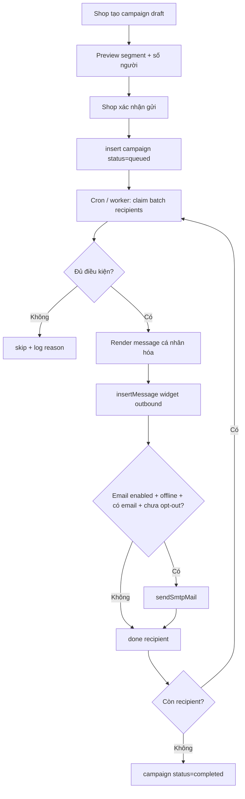

# Messaging — Bulk marketing an toàn (hướng dẫn triển khai)

Tài liệu này mô tả **cách triển khai sau** tính năng gửi tin marketing hàng loạt cho khách shop Messaging, ưu tiên **an toàn deliverability** và **ít vào spam** nhất có thể.

**Trạng thái:** chưa triển khai — chỉ là spec + checklist cho dev.

**Phạm vi module:** `fashion` (Messaging shop). Không trộn logic vào core chat; mọi thứ gate theo `partner_id` / `industry_key`.

---

## 1. Mục tiêu sản phẩm

Shop owner / nhân viên có quyền inbox có thể:

1. Tạo **campaign marketing** (một lần gửi tới nhiều khách).
2. Hệ thống gửi **tin trong chat** (kênh chính, an toàn nhất).
3. Tùy chọn gửi **email nhắc** cho khách **offline** và **có email** (kênh phụ).
4. Mỗi người nhận nội dung **cá nhân hóa theo dữ liệu thật** (tên, SP đã xem/đặt, link chat), không phải blast template giống hệt.

**Không làm trong v1:**

- Gửi email cho khách chưa từng chat / chưa có quan hệ với shop.
- Import list email ngoài hệ thống.
- AI viết lại **toàn bộ** body khác 100% mỗi người (tốn chi phí, không cải thiện deliverability đáng kể).
- Bulk marketing qua Facebook Messenger / Zalo OA hàng loạt (rủi ro policy nền tảng — để phase sau, tách spec).

---

## 2. Nguyên tắc an toàn (bắt buộc)

### 2.1 Chat-first, email-second

```
Campaign
  → (bắt buộc) insert outbound message vào từng conversation widget
  → (tùy chọn) email nhắc nếu: có email + khách offline + chưa opt-out + chưa vượt cooldown
```

Lý do: khách đã từng nhắn tin trong widget → tin marketing trong hội thoại **không phải cold email**, ít bị coi là spam nhất.

### 2.2 Chỉ audience đã tương tác

Điều kiện vào segment (mặc định — shop có thể thu hẹp thêm, **không được nới rộng**):

| Điều kiện | Bắt buộc v1 |
|-----------|-------------|
| Có `customer_care_conversations` với `partner_id` | Có |
| `channel = 'widget'` (v1 chỉ widget) | Có |
| `updated_at` hoặc tin gần nhất trong N ngày (mặc định **90**) | Có |
| Hoặc có `messaging_partner_orders` với cùng `partner_id` | Thay thế được điều kiện chat gần đây |
| Có email (`guest_account`, `linked_user_id` → `auth.users`, hoặc `customer_email` đơn) | Chỉ cần nếu bật kênh email |

### 2.3 Giới hạn tần suất

| Giới hạn | Giá trị đề xuất |
|----------|-----------------|
| Marketing campaign / khách / shop | Tối đa **1 / 14 ngày** |
| Email marketing / khách / shop | Tối đa **1 / 7 ngày** (riêng transactional đơn hàng không tính) |
| Tốc độ gửi (queue) | **1 recipient / 2 giây** (SMTP thường); điều chỉnh theo ESP |
| Dedup campaign | `ON CONFLICT DO NOTHING` theo `(partner_id, recipient_key, campaign_key)` |

Tham chiếu pattern hiện có: `tryClaimBirthdayEmailSlotFromPg` trong `src/lib/db/messaging-partner-birthday-promo-pg.ts`.

### 2.4 Opt-out marketing (bắt buộc trước khi bật email marketing)

Khách phải có cách **từ chối email khuyến mãi** từ shop (không chặn email đơn hàng / tin nhắn transactional).

- Link opt-out trong footer email marketing.
- Lưu DB → loại khỏi mọi campaign marketing sau.
- UI shop: xem số khách đã opt-out (read-only v1).

### 2.5 Cá nhân hóa có cấu trúc (merge field)

Mỗi recipient render từ template + biến:

| Biến | Nguồn |
|------|-------|
| `{customer_name}` | `profiles`, `messaging_guest_accounts`, `order.customer_name` |
| `{shop_name}` | `messaging_partners.display_name` |
| `{interest_products}` | SP đã consult / thẻ AI / `interested_inv` (xem `collectInterestInventoryIdsForPartnerUserFromPg`) |
| `{last_order_summary}` | Đơn gần nhất (nếu có) |
| `{chat_url}` | `/messaging/p/{slug}` + magic login nếu có email (xem `buildOfflineReplyAutoLoginChatUrl`) |
| `{offer_percent}` | Từ campaign (nếu shop nhập) |
| `{ui_locale}` | `conversation.metadata.ui_locale` |

**Không** dùng LLM viết full body mặc định. Nếu sau này có AI, chỉ dùng để gợi ý **1 câu mở đầu** trong giới hạn ký tự, vẫn qua template cố định.

### 2.6 Phân loại email

| Loại | Ví dụ | List-Unsubscribe | Giới hạn tần suất |
|------|-------|------------------|-------------------|
| Transactional | Đơn hàng, thanh toán, giao hàng | Không bắt buộc | Không dùng quota marketing |
| Notification | Shop trả lời, bạn có tin mới | Không bắt buộc | Cooldown ngắn (hiện ~20 phút — `OFFLINE_REPLY_EMAIL_COOLDOWN_MS`) |
| Marketing | Campaign ưu đãi shop | **Bắt buộc** | Quota 7–14 ngày |

---

## 3. Kiến trúc đề xuất

### 3.1 Luồng tổng quát



### 3.2 Tách module (theo `messaging-industry-architecture`)

| Thành phần | Vị trí đề xuất |
|------------|----------------|
| DB access | `src/lib/db/messaging-partner-marketing-campaigns-pg.ts` |
| Segment builder | `src/lib/messaging/partner-marketing-segment.ts` |
| Template render | `src/lib/messaging/partner-marketing-render.ts` |
| Queue worker | `src/lib/messaging/partner-marketing-run-jobs.ts` |
| Cron route | `src/app/api/cron/partner-marketing-campaign/route.ts` |
| Dashboard UI | `src/app/dashboard/messaging/partner-marketing-campaigns-client.tsx` |
| Server actions | `src/app/dashboard/messaging/actions.ts` (hoặc `marketing-actions.ts` tách file) |
| Opt-out API | `src/app/api/messaging/guest/[slug]/marketing-opt-out/route.ts` |

**Không** nhét logic segment/campaign vào `partner-ai-llm.ts` hay guest chat client ngoài link opt-out.

### 3.3 Code hiện có — tái sử dụng

| Nhu cầu | File tham chiếu |
|---------|-----------------|
| Gửi tin shop → 1 hội thoại | `sendPartnerReply` — `src/app/dashboard/messaging/actions.ts` |
| Insert message DB | `insertMessagePg` — `src/lib/db/customer-care-pg.ts` |
| Email SMTP | `sendSmtpMail` — `src/lib/email/smtp.ts` |
| Khách offline | `guest_viewer_last_seen_at`, `GUEST_VIEWER_LIVE_THRESHOLD_MS` — `src/lib/messaging/partner-reply-offline-customer-email.ts` |
| Resolve email khách | `resolveCustomerEmailForConversation` — cùng file trên |
| Magic link chat | `buildOfflineReplyAutoLoginChatUrl` — `src/lib/messaging/offline-reply-magic-chat-link.ts` |
| Email đa ngôn ngữ | `formatOfflineShopReplyEmailContent` — `src/lib/messaging/partner-reply-offline-email-i18n.ts` |
| Bulk email + dedup cron | `src/app/api/cron/partner-birthday-promo/route.ts` |
| Claim slot chống trùng | `tryClaimBirthdayEmailSlotFromPg` — pattern copy sang bảng campaign |
| SP quan tâm theo user | `collectInterestInventoryIdsForPartnerUserFromPg` — `src/lib/messaging/birthday-promo-interest-inventory-ids.ts` |
| Quyền staff | `assertPartnerStaffGate`, `partnerStaffHasPerm` — thêm perm `marketing_campaigns` |

---

## 4. Schema DB (đề xuất — migration additive)

Tạo migration mới trong `db/migrations/` (tên ví dụ `YYYYMMDDHHMMSS_messaging_partner_marketing_campaigns.sql`).

### 4.1 Bảng campaign

```sql
-- messaging_partner_marketing_campaigns
-- id, partner_id, created_by_user_id
-- status: draft | queued | running | completed | cancelled | failed
-- channel_chat: boolean default true
-- channel_email: boolean default false
-- segment_json: jsonb  -- rules: days_since_chat, has_order, tags...
-- template_subject, template_body_chat, template_body_email (text)
-- offer_percent int null
-- scheduled_at timestamptz null
-- started_at, completed_at
-- stats: total_queued, sent_chat, sent_email, skipped, failed
```

### 4.2 Bảng recipient / delivery log

```sql
-- messaging_partner_marketing_deliveries
-- id, campaign_id, partner_id
-- conversation_id uuid null
-- recipient_key text  -- guest_account_id | linked_user_id | external_thread_id
-- email text null
-- status: pending | sent_chat | sent_chat_email | skipped | failed
-- skip_reason text null  -- opt_out | no_email | rate_limit | not_in_segment ...
-- rendered_body_chat text null
-- rendered_body_email text null
-- sent_chat_at, sent_email_at
-- unique (campaign_id, recipient_key)
```

### 4.3 Bảng chống spam / quota

```sql
-- messaging_partner_marketing_sent_slots
-- partner_id, recipient_key, campaign_key (e.g. campaign_id or yyyy-mm-dd bucket)
-- unique (partner_id, recipient_key, campaign_key)
-- Pattern giống messaging_partner_birthday_email_sent
```

### 4.4 Opt-out

```sql
-- messaging_partner_marketing_opt_out
-- partner_id, recipient_key, email_normalized
-- opted_out_at
-- unique (partner_id, recipient_key)
```

**Sau migration:** cập nhật `src/types/database.types.ts`.

**Chạy migration:**

```bash
# Local (Windows CMD)
node scripts/pg-run-sql-file.mjs db/migrations/<file>.sql --apply

# VPS: pull code → chạy file migration mới → build → restart
```

---

## 5. API & UI (dashboard shop)

### 5.1 Quyền

- Owner: full.
- Staff: cần perm mới `marketing_campaigns` (read + send).
- Không cho guest / embed key gọi API campaign.

### 5.2 Màn hình đề xuất

**Đường dẫn:** `/dashboard/messaging` → tab **Marketing** (hoặc sub-page).

**Bước wizard:**

1. **Đối tượng** — preset: «Đã chat 90 ngày», «Đã đặt hàng», «Tùy chỉnh» (chỉ thu hẹp).
2. **Nội dung** — template chat (+ preview email nếu bật). Hiển thị biến merge được hỗ trợ.
3. **Kênh** — ☑ Chat (mặc định bật, không tắt v1) · ☐ Email nhắc (offline only).
4. **Xem trước** — 3 khách mẫu + số lượng segment.
5. **Gửi** — đưa vào queue; hiển thị tiến trình.

**Sau khi gửi:** bảng log per-recipient (sent / skipped + lý do).

### 5.3 Server actions (gợi ý)

| Action | Mô tả |
|--------|-------|
| `previewMarketingSegment(partnerId, segmentJson)` | Đếm + 3 row mẫu |
| `createMarketingCampaignDraft(...)` | `status=draft` |
| `queueMarketingCampaign(campaignId)` | `draft → queued` |
| `cancelMarketingCampaign(campaignId)` | Chỉ khi `queued` hoặc `running` |

Worker **không** chạy trong server action đồng bộ — tránh timeout.

### 5.4 Cron

```
GET|POST /api/cron/partner-marketing-campaign
Authorization: Bearer <CRON_SECRET hoặc MESSAGING_PARTNER_AI_CRON_SECRET>
```

Mỗi lần chạy:

- Lấy tối đa **1 campaign `running`** hoặc promote **1 `queued`** → `running`.
- Xử lý **batch_size = 10–30** recipients (tùy timeout).
- `maxDuration` route: 300s (giống birthday cron).

**Lịch VPS:** mỗi 1 phút (cùng nhóm cron messaging).

---

## 6. Deliverability email (checklist vận hành)

Triển khai code **chưa đủ** — cần cấu hình infra:

| Hạng mục | Yêu cầu |
|----------|---------|
| SPF / DKIM / DMARC | Domain gửi (`SMTP_FROM`) phải có bản ghi đúng |
| Subdomain riêng | Khuyến nghị `notify.<domain>` hoặc ESP subdomain |
| ESP | Khi > ~50 email/ngày/shop: cân nhắc SendGrid / AWS SES / Resend thay SMTP hosting |
| From | `Shop Name <noreply@...>` — tên shop trong display name, domain ổn định |
| Subject | Có tên shop + ngữ cảnh cá nhân; tránh ALL CAPS / nhiều dấu `!` |
| Body | 1 CTA (mở chat); ít link; có text plain + HTML |
| List-Unsubscribe | Header + link footer cho marketing |
| Bounce handling | Log lỗi SMTP; sau N lần fail → đánh dấu email invalid, không gửi marketing |

**Biến môi trường hiện tại:** `SMTP_HOST`, `SMTP_PORT`, `SMTP_USER`, `SMTP_PASS`, `SMTP_FROM` — xem `src/lib/email/smtp.ts`, `docs/ENV_LOCAL_REFERENCE.md`.

---

## 7. Nội dung template — gợi ý mặc định

### Chat (widget)

```
Xin chào {customer_name},

{shop_name} có ưu đãi dành riêng cho bạn{offer_line}.

{interest_block}

Mở chat để xem giá và đặt hàng ngay trên hội thoại này.
```

`{interest_block}`: tối đa 3 SP (tên + SKU), lấy từ lịch sử consult.

### Email (chỉ khi offline)

- Subject (vi): `{shop_name} — Gợi ý dành cho bạn`
- Body: ngắn hơn chat; nhấn mạnh «Bạn có tin mới trong cuộc trò chuyại» + nút CTA `Mở cuộc trò chuyện`.
- Footer: opt-out + «Tin khuyến mãi từ {shop_name} qua NanoAI».

Dùng pattern i18n giống `formatOfflineShopReplyEmailContent` — đủ 5 locale web (`vi`, `en`, `zh`, `ja`, `ko`).

---

## 8. Phase triển khai

### Phase 1 — An toàn nhất (nên làm trước)

- [ ] Schema campaign + deliveries + sent_slots
- [ ] Segment: đã chat widget ≤ 90 ngày
- [ ] Chỉ **chat** — không email
- [ ] Cron worker + dashboard wizard tối giản
- [ ] Perm staff `marketing_campaigns`
- [ ] Test: 3 khách, 50 khách, campaign trùng bị chặn

### Phase 2 — Email nhắc offline

- [ ] Bảng opt-out + API opt-out + link email
- [ ] Email render + magic chat link
- [ ] Cooldown 7 ngày email marketing
- [ ] i18n đủ 5 ngôn ngữ
- [ ] Test deliverability (Gmail + Outlook seed accounts)

### Phase 3 — Nâng cao (tùy chọn)

- [ ] Segment: đã đặt hàng / SP đã consult
- [ ] Lên lịch gửi `scheduled_at`
- [ ] Báo cáo mở chat sau campaign (conversion đơn giản)
- [ ] ESP adapter tách khỏi `sendSmtpMail`
- [ ] **Không** ưu tiên: FB/Zalo bulk marketing

---

## 9. Checklist QA trước release

### Chức năng

- [ ] Campaign chỉ gửi đúng segment; khách ngoài segment không nhận tin.
- [ ] Mỗi khách tối đa 1 lần / campaign.
- [ ] Không gửi 2 campaign marketing trong 14 ngày cho cùng khách.
- [ ] Opt-out: sau khi opt-out không nhận email marketing; vẫn nhận email đơn hàng.
- [ ] Khách đang live trên chat (`guest_viewer_last_seen_at` gần) — **không** gửi email (v1).
- [ ] Tin chat xuất hiện đúng trong inbox shop + widget khách.
- [ ] Staff không có perm → không thấy / không gửi được.

### Hồi quy (bắt buộc — regression guard messaging)

- [ ] `sendPartnerReply` 1-1 vẫn hoạt động.
- [ ] `maybeEmailCustomerOfflineShopReply` không bị gọi nhầm từ campaign (hoặc có cooldown tách biệt).
- [ ] Birthday promo cron vẫn chạy độc lập.
- [ ] Luồng đơn hàng / email đơn không đổi.
- [ ] Guest chat widget: nhập tin, đặt hàng, visual — không vỡ.

### Deliverability (staging)

- [ ] Gửi thử 10 email seed — không vào spam (hoặc ghi nhận tỷ lệ).
- [ ] Rate limit: không vượt 1 email / 2s.
- [ ] Log đủ `skip_reason` để debug.

---

## 10. Những điều không làm

1. **Không** gửi marketing email cho khách không có conversation widget.
2. **Không** gửi đồng bộ hàng trăm recipient trong một HTTP request.
3. **Không** dùng nội dung «GIẢM SỐC», quá nhiều link ảnh, file đính kèm nặng.
4. **Không** chia sẻ domain SMTP marketing với OTP login nếu tránh được (tách subdomain).
5. **Không** bỏ opt-out khi đã bật email marketing.
6. **Không** refactor rộng inbox / guest chat khi chỉ thêm tab Marketing.

---

## 11. i18n

Mọi label UI dashboard + email marketing phải qua dictionary:

- Thêm key vào `src/lib/i18n/dictionaries.ts` — đủ `vi`, `en`, `zh`, `ja`, `ko`.
- Email body theo `ui_locale` conversation (fallback `vi`).

---

## 12. Ước lượng độ phức tạp

| Phase | Ước lượng |
|-------|-----------|
| Phase 1 (chat only) | 3–5 ngày dev + QA |
| Phase 2 (email + opt-out) | +3–4 ngày + infra SMTP/ESP |
| Phase 3 | tùy scope |

---

## 13. Liên hệ tài liệu khác

- Industry isolation: `.cursor/rules/messaging-industry-architecture.mdc`
- Multilingual: `.cursor/rules/multilingual-i18n.mdc`
- Birthday promo cron (mẫu bulk an toàn): `src/app/api/cron/partner-birthday-promo/route.ts`
- Offline reply email: `src/lib/messaging/partner-reply-offline-customer-email.ts`
- Migration policy: `MIGRATION_GUIDE.md`, `db/README.md`

---

*Cập nhật lần đầu: 2026-07-10 — spec từ thảo luận bulk marketing an toàn.*
